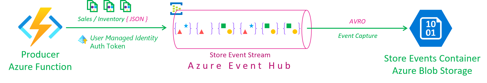

# Event Streaming with Azure Event Hub

The stores operated by Mystique enterprise generate a lot of events related to sales and inventory from multiple locations. In order to efficiently handle this high volume of data and facilitate further processing, Mystique enterprise requires a solution that allows them to ingest the data and store it in a central location. In addition, Mystique enterprise also requires the ability to selectively process events based on specific properties. For instance, they are interested in filtering events that are classified as `sale_event` or `inventory_event`. This selective processing helps them focus on relevant data for analysis and decision-making. Further to that, Mystique enterprise wants to apply further filtering by only considering events that have a `discount` greater than `20`. This feature is crucial for analyzing business metrics, such as `total_sales` and `total_discounts`, as well as identifying potential fraudulent activity.

A sample of their event is shown below Can you help them?

```json
{
  "id": "743da362-69df-4e63-a95f-a1d93e29825e",
  "request_id": "743da362-69df-4e63-a95f-a1d93e29825e",
  "store_id": 5,
  "store_fqdn": "localhost",
  "store_ip": "127.0.0.1",
  "cust_id": 549,
  "category": "Notebooks",
  "sku": 169008,
  "price": 45.85,
  "qty": 34,
  "discount": 10.3,
  "gift_wrap": true,
  "variant": "red",
  "priority_shipping": false,
  "ts": "2023-05-19T14:36:09.985501",
  "contact_me": "github.com/miztiik",
  "is_return": true
}
```

Event properties,

```json
{
   "event_type":"sale_event",
   "priority_shipping":false,
}
```

 Can you provide guidance on how to accomplish this?

## 🎯 Solution

To meet their needs, Mystique enterprise has chosen [Azure Event Hub][1] as the platform of choice. It provides the necessary capabilities to handle the ingestion and storage of the data. We can utilize the [capture streaming events capability][2] of Azure Event Hub to persist the message to Azure Blob Storage. This allows us to store the data in a central location for further processing.

In addition, Azure Event Hub also provides the ability to filter messages based on specific properties. This feature can be leveraged to selectively process events based on specific criteria. For instance, we can filter events that are classified as `sale_event` or `inventory_event`. This allows us to focus on relevant data for analysis and decision-making. Further to that, we can apply further filtering by only considering events that have a `discount` greater than `20`. This feature is crucial for analyzing business metrics, such as `total_sales` and `total_discounts`, as well as identifying potential fraudulent activity.

By utilizing Azure Event Hub and applying these filtering mechanisms, Mystique enterprise will be able to efficiently handle and process their high-volume event data, enabling them to gain valuable insights and make informed business decisions.

In this demonstration, an Azure Function with a managed identity will generate events and send them to event hub within a designated event hub namespace. The hub is configred with `4` subscriptions, We can use the partitions to segregate events based on the `event_type` property. For example, `sale_events` and `inventory_events` can be sent to different partitions. This allows us to process events based on specific criteria. For instance, we can filter events that are classified as `sale_event` or `inventory_event`. This allows us to focus on relevant data for analysis and decision-making. Further to that, we can apply further filtering by only considering events that have a `discount` greater than `20`. This feature is crucial for analyzing business metrics, such as `total_sales` and `total_discounts`, as well as identifying potential fraudulent activity.


The consumer function utilizes a subscription trigger on the `sale_events` topic to consume events from the topic. It then processes and persists these events to an Azure Storage Account and Cosmos DB. To ensure secure and controlled access to the necessary resources, a scoped managed identity with RBAC (Role-Based Access Control) permissions is employed. Additionally, the trigger connection is authenticated using a managed identity.

By leveraging the capabilities of Bicep, all the required resources can be easily provisioned and managed with minimal effort. Bicep simplifies the process of defining and deploying Azure resources, allowing for efficient resource management.



1. ## 🧰 Prerequisites

   This demo, instructions, scripts and bicep template is designed to be run in `northeurope`. With few or no modifications you can try it out in other regions as well(_Not covered here_).

   - 🛠 Azure CLI Installed & Configured - [Get help here](https://learn.microsoft.com/en-us/cli/azure/install-azure-cli)
   - 🛠 Azure Function Core Tools - [Get help here](https://learn.microsoft.com/en-us/azure/azure-functions/functions-run-local?tabs=v4%2Cwindows%2Ccsharp%2Cportal%2Cbash#install-the-azure-functions-core-tools)
   - 🛠 Bicep Installed & Configured - [Get help here](https://learn.microsoft.com/en-us/azure/azure-resource-manager/bicep/install)
     - 🛠 [Optional] VS Code & Bicep Extenstions - [Get help here](https://learn.microsoft.com/en-us/azure/azure-resource-manager/bicep/install#vs-code-and-bicep-extension)
   - `jq` - [Get help here](https://stedolan.github.io/jq/download/)
   - `bash` or git bash - [Get help here](https://git-scm.com/downloads)

2. ## ⚙️ Setting up the environment

   - Get the application code

     ```bash
     git clone https://github.com/miztiik/azure-svc-bus-msg-consumer-with-filter.git
     cd azure-svc-bus-msg-consumer-with-filter
     ```

3. ## 🚀 Prepare the local environment

   Ensure you have jq, Azure Cli and bicep working

    ```bash
   jq --version
   func --version
   bicep --version
   bash --version
   az account show
    ```

4. ## 🚀 Deploying the Solution

   - **Stack: Main Bicep**
     We will create the following resoureces
     - **Storage Accounts** for storing the events
       - General purpose Storage Account - Used by Azure functions to store the function code
       - `warehouse*` -  Azure Function will store the events here
     - **Servie Bus Namespace**
       - Service Bus Topic, with following subscriptions
         - `All Events`
         - `Inventory_Events`
         - `Sale_Events`
         - `Fraud_Events`
     - **Managed Identity**
        - This will be used by the Azure Function to interact with the service bus
     - **Python Azure Function**
        - **Producer**: `HTTP` Trigger. Customized to send `count` number of events to the service bus, using parameters passed in the query string. `count` defaults to `10`
        - **Consumer**: `Service Bus Topic Subscription` Trigger. The trigger uses managed identity to authenticate to the service bus.
     - **Cosmos DB**
        - This will be used by the Azure Function to store the events

      ```bash
      # make deploy
      sh deployment_scripts/deploy.sh
      ```

      After successfully deploying the stack, Check the `Resource Groups/Deployments` section for the resources.

5. ## 🔬 Testing the solution

   - **Trigger the function**

      ```bash
      FUNC_URL="https://svc-bus-msg-filter-store-backend-fn-app-004.azurewebsites.net/api/store-events-producer-fn"
      curl ${FUNC_URL}?count=10
      ```

      You should see an output like this,

      ```json
         {
         "miztiik_event_processed": true,
         "msg": "Generated 10 messages",
         "resp": {
            "status": true,
            "tot_msgs": 10,
            "bad_msgs": 2,
            "sale_evnts": 8,
            "inventory_evnts": 2,
            "tot_sales": 507.57
         },
         "count": 10,
         "last_processed_on": "2023-05-21T14:03:45.505416"
         }

      ```

      Our function has produced `10` messages with `8` of them were `sale_events` and `2` of them were `inventory_events`. We can find the same being processed by sale_events and inventory_events subscriptions. Likewise, we see `8` records blob and cosmos.


      

6. ## 📒 Conclusion

   In this demonstration, we have showcased the utilization of Azure Functions to send messages to Azure Service Bus and leverage message filters to perform actions on specific messages. This approach allows for efficient message processing and enables targeted handling based on specific criteria.
  
7. ## 🧹 CleanUp

   If you want to destroy all the resources created by the stack, Execute the below command to delete the stack, or _you can delete the stack from console as well_

   - Resources created during [Deploying The Application](#-deploying-the-application)
   - _Any other custom resources, you have created for this demo_

   ```bash
   # Delete from resource group
   az group delete --name Miztiik_Enterprises_xxx --yes
   # Follow any on-screen prompt
   ```

   This is not an exhaustive list, please carry out other necessary steps as maybe applicable to your needs.

## 📌 Who is using this

This repository aims to show how to Bicep to new developers, Solution Architects & Ops Engineers in Azure.


### 💡 Help/Suggestions or 🐛 Bugs

Thank you for your interest in contributing to our project. Whether it is a bug report, new feature, correction, or additional documentation or solutions, we greatly value feedback and contributions from our community. [Start here](/issues)

### 👋 Buy me a coffee

[](https://ko-fi.com/Q5Q41QDGK) Buy me a [coffee ☕][900].

### 📚 References

1. [Azure Docs - Event Hub][1]
1. [Azure Docs - Event Hub - Streaming Event Capture][2]
1. [Azure Docs - Service Bus Topic Filter Limitations][2]
1. [Azure Docs - Managed Identity][8]
1. [Azure Docs - Managed Identity Caching][9]
1. [Gitub Issue - Default Credential Troubleshooting][10]
1. [Gitub Issue - Default Credential Troubleshooting][11]

[1]: https://learn.microsoft.com/en-us/azure/event-hubs
[2]: https://learn.microsoft.com/en-us/azure/event-hubs/event-hubs-capture-overview
[8]: https://learn.microsoft.com/en-us/azure/active-directory/managed-identities-azure-resources/overview
[9]: https://learn.microsoft.com/en-us/azure/app-service/overview-managed-identity?tabs=portal%2Chttp#configure-target-resource
[10]: https://github.com/microsoft/azure-container-apps/issues/442
[11]: https://github.com/microsoft/azure-container-apps/issues/325#issuecomment-1265380377

### 🏷️ Metadata


**Level**: 200

[100]: https://www.udemy.com/course/aws-cloud-security/?referralCode=B7F1B6C78B45ADAF77A9
[101]: https://www.udemy.com/course/aws-cloud-security-proactive-way/?referralCode=71DC542AD4481309A441
[102]: https://www.udemy.com/course/aws-cloud-development-kit-from-beginner-to-professional/?referralCode=E15D7FB64E417C547579
[103]: https://www.udemy.com/course/aws-cloudformation-basics?referralCode=93AD3B1530BC871093D6
[899]: https://www.udemy.com/user/n-kumar/
[900]: https://ko-fi.com/miztiik
[901]: https://ko-fi.com/Q5Q41QDGK